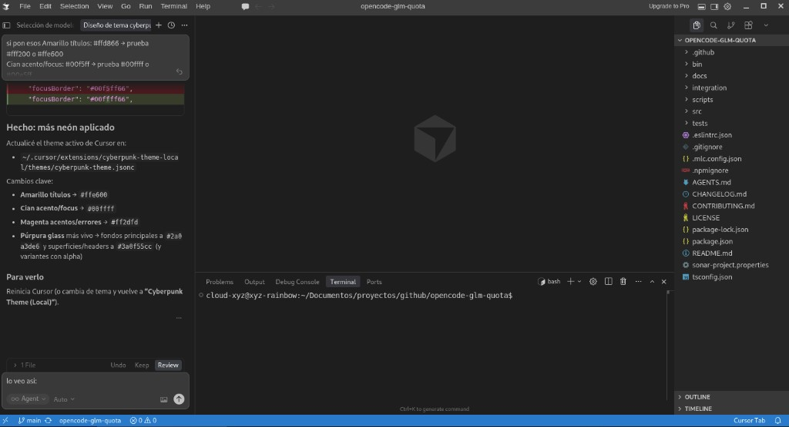

# Rainbow Cyberpunk Neon

Tema oscuro cyberpunk / cristal para **VS Code** y **Cursor**: lima, cyan, amarillo, rosa, naranja y rojo neón, con fondos púrpura translúcidos.

No hace falta Marketplace: instálalo desde este repositorio (véase abajo).

## Paleta (prioridad visual)

1. Lima neón (chartreuse) `#c8ff00`
2. Cyan neón `#00ffff`
3. Amarillo neón `#ffff00`
4. Rosa neón `#ff00d4`
5. Naranja neón `#ff6a00`
6. Rojo neón `#ff3131`

## Captura



## Instalación desde GitHub (sin tarjeta, sin Marketplace)

### Opción A: clonar en la carpeta de extensiones (Cursor)

```bash
cd ~/.cursor/extensions
git clone https://github.com/xyz-rainbow/rainbow-cyberpunk-neon-theme.git
```

Reinicia Cursor. Luego `Ctrl+Shift+P` → **Preferences: Color Theme** → **Rainbow Cyberpunk Neon**.

### Opción B: VSIX local

En el clon del repo:

```bash
cd rainbow-cyberpunk-neon-theme
npx @vscode/vsce package
code --install-extension rainbow-cyberpunk-neon-theme-0.1.0.vsix
```

En Cursor suele ser el mismo comando `code` o instala el `.vsix` desde la paleta de comandos si tu build lo permite.

### Opción C: VS Code (extensión en `~/.vscode/extensions`)

```bash
cd ~/.vscode/extensions
git clone https://github.com/xyz-rainbow/rainbow-cyberpunk-neon-theme.git
```

## Personalización extra (Cursor / VS Code)

Puedes refinar peso de fuente en `settings.json`:

```json
"editor.fontWeight": "500",
"terminal.integrated.fontWeight": "500"
```

## Autor

- GitHub: **xyz-rainbow**
- Correo: `rainbow@rainbowtechnology.xyz`

MIT License — ver `LICENSE`.
